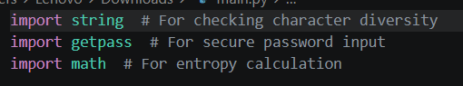

# Password Strength Checker

## Content
- [Prerequisites](https://github.com/thechiragvaishnav-dotcom/Password-Strength-Checker#prerequisites)
- [Step 1: Setting Up the Project](https://github.com/thechiragvaishnav-dotcom/Password-Strength-Checker#step-1-setting-up-the-project)

## Prerequisites

## Step 1: Setting Up the Project
- Create a Folder on your Desktop name Password-Strength-Checker
  - <code>Right-click</code>
  - New / Folder
    
    
- Open that Folder & inside that Folder we need to Open Power Shell Terminal 
  - <code>Shift</code> + <code>Right-click</code>
  - <code>Leftt-click</code> on Open PowerShell window here

     
- Inside that Power Shell Terminal
  - type <code>code .</code> + <code>Enter</code>

     
    - VS Code will open if not do it manually
- Inside that VS Code Create New File

   
   
- Name it "password_checker.py" or anything you want + <code>Enter</code> to Create

   

## [Back to Content](https://github.com/thechiragvaishnav-dotcom/Password-Strength-Checker#content)

## Step 2: Understanding How the Password Strength Checker Works
**Our program will:**
- Prompt the user to enter a password securely using getpass.
- Evaluate the password’s strength based on length, character variety, and entropy.
- Provide feedback on password quality and improvements.
- Allow the user to check multiple passwords in a loop until they decide to exit.

## [Back to Content](https://github.com/thechiragvaishnav-dotcom/Password-Strength-Checker#content)

## Step 3: Importing Required Modules

We need three Python modules:

