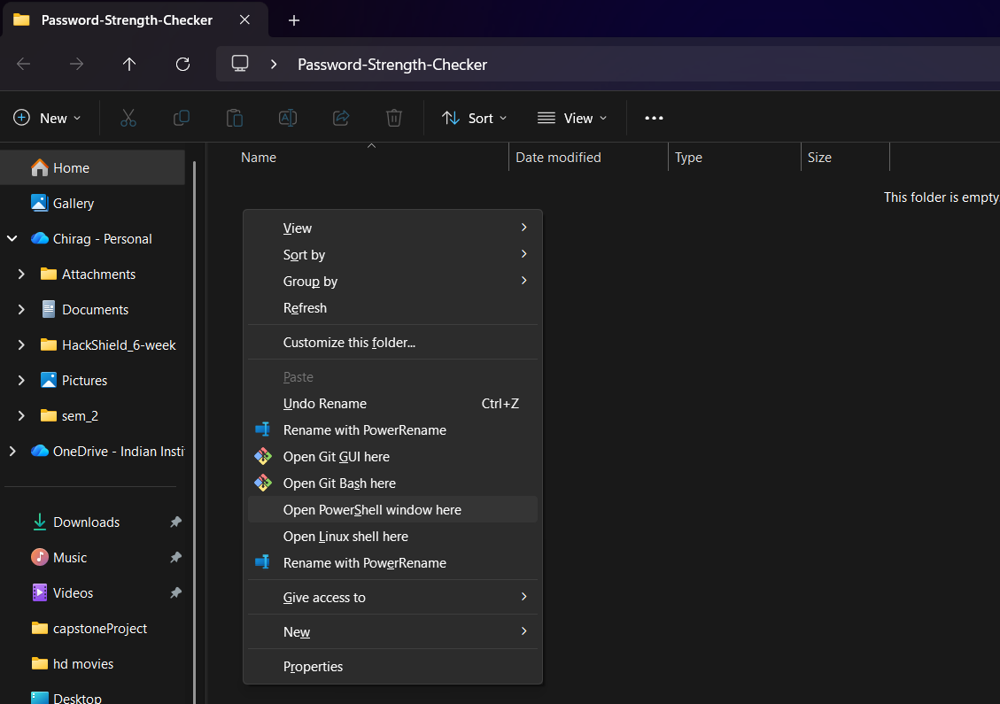
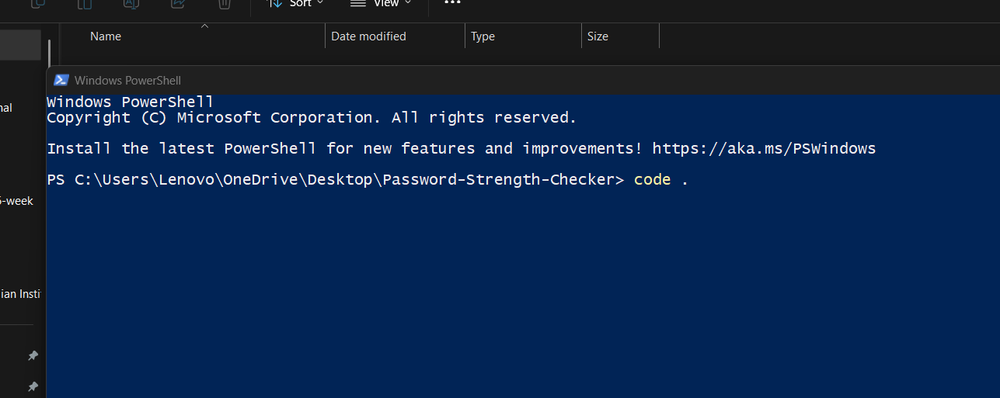
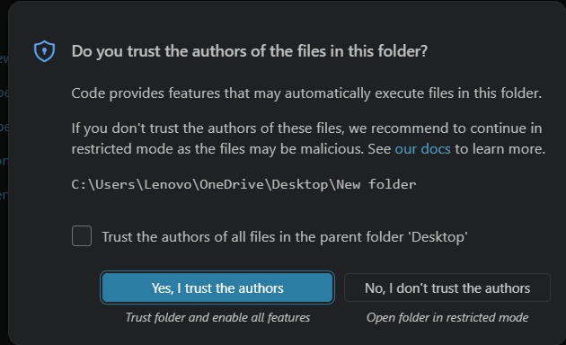
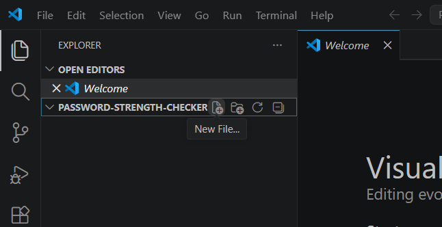
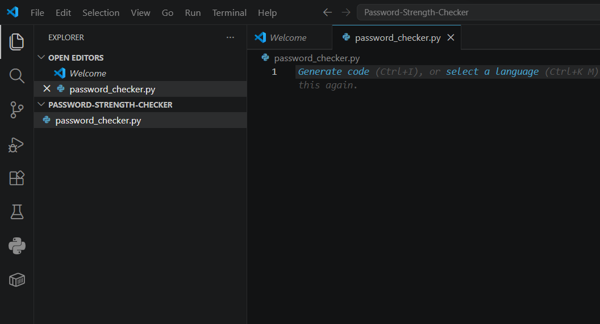

# Password Strength Checker

## Content
- [Prerequisites](https://github.com/thechiragvaishnav-dotcom/Password-Strength-Checker#prerequisites)
- [Step 1: Setting Up the Project](https://github.com/thechiragvaishnav-dotcom/Password-Strength-Checker#step-1-setting-up-the-project)
- [Step 2: Understanding How the Password Strength Checker Works](https://github.com/thechiragvaishnav-dotcom/Password-Strength-Checker#step-2-understanding-how-the-password-strength-checker-works)
- [Step 3: Importing Required Modules](https://github.com/thechiragvaishnav-dotcom/Password-Strength-Checker#step-3-importing-required-modules)
- [Step 4: Implementing Password Entropy Calculation](https://github.com/thechiragvaishnav-dotcom/Password-Strength-Checker#step-4-implementing-password-entropy-calculation)

## Prerequisites

## Step 1: Setting Up the Project
- Create a Folder on your Desktop name Password-Strength-Checker
  - <code>Right-click</code>
  - New / Folder
    
    
- Open that Folder & inside that Folder we need to Open Power Shell Terminal 
  - <code>Shift</code> + <code>Right-click</code>
  - <code>Leftt-click</code> on Open PowerShell window here

     
- Inside that Power Shell Terminal
  - type <code>code .</code> + <code>Enter</code>

     
    - VS Code will open if not do it manually
- Inside that VS Code <code>Left-click</code> on <code>Yes, I trust this authors</code>

   

- Create New File
  
   
- Name it "password_checker.py" or anything you want + <code>Enter</code> to Create

   

## [Back to Content](https://github.com/thechiragvaishnav-dotcom/Password-Strength-Checker#content)

## Step 2: Understanding How the Password Strength Checker Works
Our program will:
- Prompt the user to enter a password securely using **getpass**.
- Evaluate the password’s strength based on **length, character variety, and entropy**.
- Provide feedback on password quality and improvements.
- Allow the user to check multiple passwords in a loop until they decide to exit.

## [Back to Content](https://github.com/thechiragvaishnav-dotcom/Password-Strength-Checker#content)

## Step 3: Importing Required Modules

We need three Python modules:

<pre><code>import string 
import getpass  
import math
</code></pre>
  
- **Why Do We Use These Modules?**
  - **string** → Provides predefined character sets (lowercase, uppercase, digits, special characters).
  - **getpass** → Allows secure password entry without displaying it on the screen.
  - **math** → Used to calculate password entropy for strength evaluation.

Now that we have our required modules, let's move on to [defining our functions](https://hackr.io/blog/python-define-function).

## [Back to Content](https://github.com/thechiragvaishnav-dotcom/Password-Strength-Checker#content)

## Step 4: Implementing Password Entropy Calculation

Let's start by writing the core password evaluation functions.

<pre><code>MIN_LENGTH = 8

def calculate_entropy(password):
    """Calculates entropy based on character diversity and length."""
    charset_size = 0
    if any(c in string.ascii_lowercase for c in password):
        charset_size += 26
    if any(c in string.ascii_uppercase for c in password):
        charset_size += 26
    if any(c in string.digits for c in password):
        charset_size += 10
    if any(c in string.punctuation for c in password):
        charset_size += len(string.punctuation)
    if any(c.isspace() for c in password):
        charset_size += 1
    
    return len(password) * math.log2(charset_size) if charset_size else 0
</code></pre>

**How It Works:**
- **Identifies character diversity** by checking if the password contains **lowercase, uppercase, digits, special characters, or spaces**.
- **Uses entropy calculation** to determine password strength using the formula **entropy = length * log2(character_set_size)**.
- **Higher entropy = stronger password**, making it harder for attackers to guess.

Why Do We Use Entropy?

Entropy is a **scientific measure** of password strength. Instead of just checking if a password contains numbers or symbols, **entropy estimates how unpredictable a password is:**

- **Higher entropy** → More combinations → Harder to crack.

- **Lower entropy** → Easier to guess → Weaker security.

By using entropy-based evaluation, we provide a **better security analysis** rather than just counting characters.

Now that we have password entropy in place, let’s proceed to evaluating password strength and user feedback.

## [Back to Content](https://github.com/thechiragvaishnav-dotcom/Password-Strength-Checker#content)

## 
